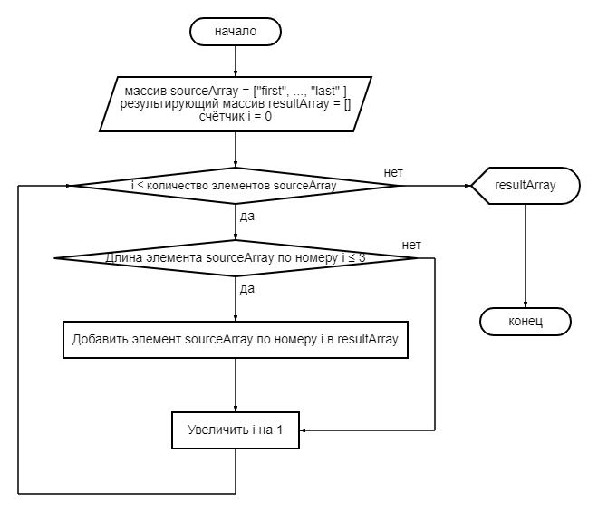

# **Блок схема**

# **Пошаговая инструкция**
* Получить на вход массив строк
* Создать результирующий массив массив нулевой длины
* В цикле пройтись по элементам входного массива
* Если длина элемента входного массива меньше или * равна 3: увеличить длину результирующего массива * на 1, и добавить в него текущий элемент входного * массива
* Вывести результирующий массив в консоль